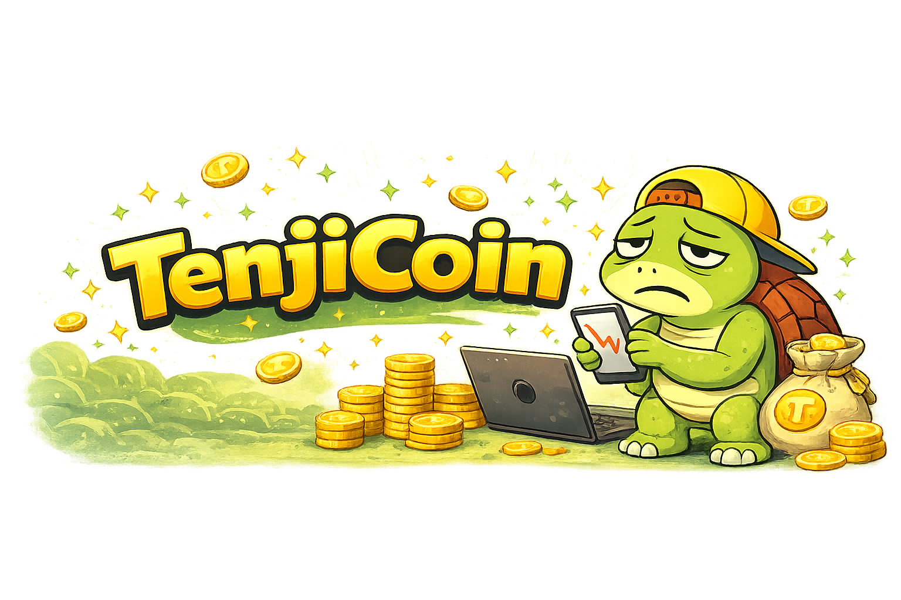

<p align="center">
  
</p>

<h1 align="center">Tenji</h1>

<p align="center">
  A meme project built around a turtle that is always a little too late.
</p>

<p align="center">
  <a href="https://tenjicoin.vercel.app">Website</a>
  •
  <a href="https://x.com/CoinTenji70103">Twitter / X</a>
</p>

---

## About

Tenji is a meme-driven crypto project with a simple idea:

being too late to buy,
too late to sell,
too late to react —
and still coming back for the next trade.

This GitHub organization is the technical home of the Tenji ecosystem.

---

## Core Repositories

| Repository                                                    | Purpose                                                                                     |
| ------------------------------------------------------------- | ------------------------------------------------------------------------------------------- |
| [`TenjiCoin`](https://github.com/TenjiCoin/TenjiCoin)         | Core smart contracts, airdrop logic, deployment scripts, tests, and technical documentation |
| [`tenji-website`](https://github.com/Tenyokj/tenjicoin-front) | Official website                                                                            |
| [`tenji-docs`](https://github.com/TenjiCoin/tenji-docs)       | Documentation and guides                                                                    |
| [`tenji-assets`](https://github.com/TenjiCoin/tenji-assets)   | Branding and media assets                                                                   |

---

## For Developers

```bash
git clone https://github.com/TenjiCoin/TenjiCoin.git
cd TenjiCoin
npm install
npm test
```

---

## Philosophy

Tenji is intentionally simple.

* fixed supply
* transparent structure
* simple mechanics
* open code

No unnecessary complexity.

---

## Disclaimer

Tenji is a meme project.

Nothing here is financial advice or a guarantee of future value.
Always do your own research.

---

## Contact

* Email: [tenjicoin@gmail.com](mailto:tenjicoin@gmail.com)
